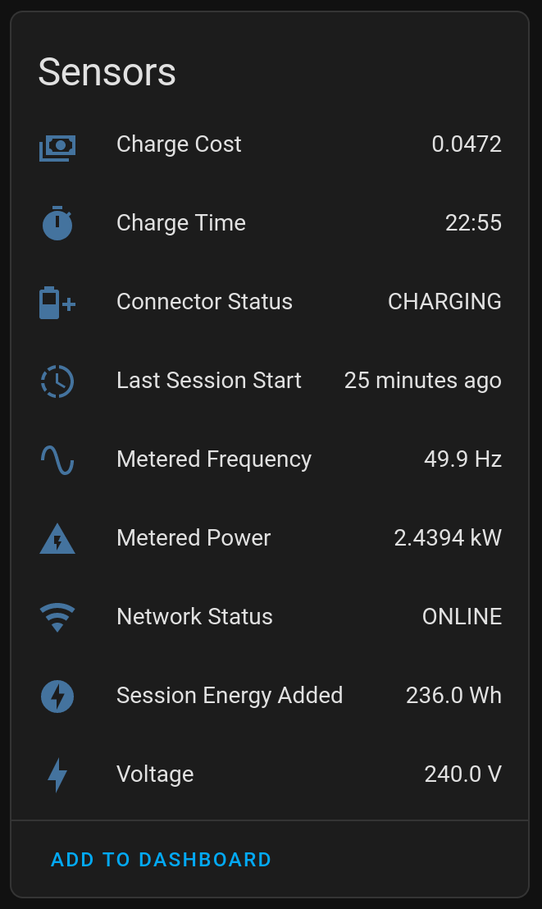

 

# Evnex for Home Assistant

A cloud-polling Home Assistant component to expose Evnex Charger information.

Uses https://github.com/hardbyte/python-evnex

Adds a device for the Evnex cloud account, as well as any chargers you have access to.

## Sensors

Each charger device exposes:

- Network status
- Charger status
- Connector status for each connector
- Metered Power/Voltage and Frequency for each metered connection
- Current session information

## Screenshot

