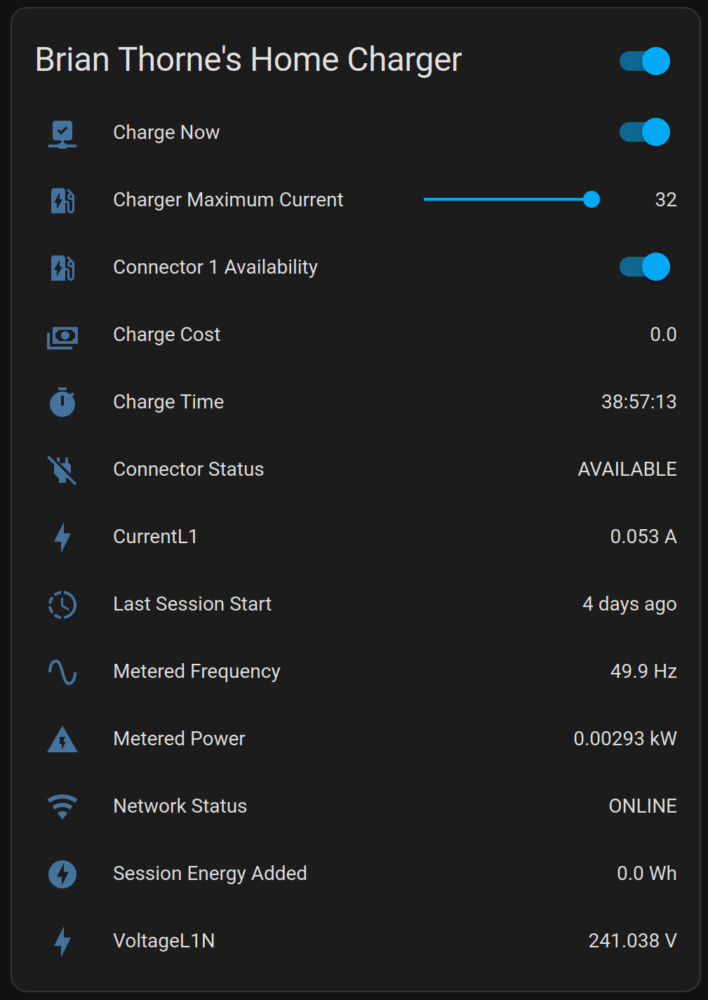

# Evnex for Home Assistant

A cloud-polling Home Assistant component to expose Evnex Charger information.

Adds a device for the Evnex cloud account, as well as any chargers you have access to. Each charger exposes a switch to control starting and pausing of charging.

## Install

Available as an integration in HACS.

Since version `0.6.0` this integration requires Pydantic >2.0, some versions of Home Assistant may not have this version 
available, you may need to install it manually e.g. with `pip install -U pydantic`.

## Sensors

Each charger device exposes:

- Network status
- Charger status
- Connector status for each connector
- Metered Power/Voltage and Frequency for each metered connection
- Current session information

## Screenshot

## Development

Uses https://github.com/hardbyte/python-evnex

